## Calculate in each position frequency of codons and amino acids from a multiple sequence alignment and draw an interactive scatter plot

The software code and data contained in this folder were used during the work published in **In Vitro and Viral Evolution Convergence Reveal the Selective Pressures Driving Omicron Emergence** publication by Shoshany et al. (submitted, see [bioRxiv](https://www.biorxiv.org/content/10.1101/2025.04.23.650148v1)). Original input data, calculated frequencies in TSV files and also the ready-made figures in JPG/PNG/PDF/HTML+Javascript can be found at [DOI:10.5281/zenodo.17252728](https://zenodo.org/records/17252728) meanwhile. One does not need to install these two utilities to study the results. However, we provide our code to facilitate similar studies of other datasets.

We developed two standalone programs:
`calculate_codon_frequencies` takes a multiple sequence alignment file in a FASTA format (possibly padded with `-` as gaps) and calculates frequencies of the codons. It parses a reference nucleotide sequence of the respective protein to stay in the reading frame (only reading frame +1 is supported). Therefore it is best to map sequencing reads (notably including amplification primer sequences to anchor the alignment ends perfectly) to a complete open reading frame (ORF) sequence encoding the protein (incl. START and STOP codons) although only part of it may have been studied. When this is followed the nucleotide or amino acid positions can be easily calculated from the padding with dashes (`-`) in a multi-FASTA 2-line file (input multiple-sequence alignment file). Otherwise the program allows to specify an arbitrary offset (to be added to the output codon position values) to output native coordinates despite short sequence provided. One can also specify some narrow regions (multiples of three) so that not all columns are to be inspected and codon frequencies calculated.

`mutation_scatter_plot` when run on a graphical terminal opens an interactive matplotlib window with the figures. One can use computer mouse to `hover()` the bubbles to see detailed annotation. After closing the interactive window it also outputs files in JPG, PNG and PDF format and finally also JSON and an interactive HTML+javascript output files are created. One can disable the interactive matplotlib window being raised by adjusting the `MPLBACKEND` environment variable (read further below).

Interactive figures can be visualized and individual frequencies of mutations inspected using python with [matplotlib](https://matplotlib.org/) and [mplcursors](https://pypi.org/project/mplcursors/) installed and concurrently, interactive HTML files are rendered thanks to [Bokeh](https://bokeh.org/).


## System requirements

Any `python-3.10` or newer will work fine. We use python-3.11 and 3.12.

We developed the software using the following versions:
```
>=python-3.10
>=biopython-1.81
>=matplotlib-3.8.4
>=mplcursors-0.5.3
>=pandas-2.2.2
>=numpy-2.2.5
>=blosum-2.0.3
>=bokeh-3.7.2
```

**Installation**

The package is installed with a single command that handles all dependencies automatically. Follow either A.1 (pip) or A.2 (conda) route.

After installation the following commands are available on your `PATH`: `mutation_scatter_plot`, `calculate_codon_frequencies`, `count_motifs_in_sequences`, `alignment2dots`, and `split_fasta_entries_by_lengths`.

The top-level `scripts/` directory contains shell helper scripts (`render-figures.sh`, `per_residue_frequencies.sh`, `create_per_residue_tables.sh`, `split_fasta_entries_by_lengths.sh`) that are **not** installed by `pip install -e .` — they are provided as reference workflows and must be run directly from the `scripts/` directory or copied manually to a location on your `PATH`.

**A.1 Install using pip into a virtual environment**

```bash
git clone https://github.com/host-patho-evo/mutation_scatter_plot.git
cd mutation_scatter_plot
python3 -m venv .venv
source .venv/bin/activate
pip install -e .
```

Later you can re-enter this virtual environment by `source .venv/bin/activate`. To leave it call `deactivate`.

To yield interactive matplotlib figures one of the following backends must also be installed:

```bash
pip install wxpython
pip install pyqt5
pip install pyqt6
pip install pycairo
pip install cairocffi
```

**A.2 Install using conda**

```bash
git clone https://github.com/host-patho-evo/mutation_scatter_plot.git
cd mutation_scatter_plot
conda create -n mutation_scatter_plot python=3.13
conda activate mutation_scatter_plot
pip install -e .
```

To yield interactive figures, one of the matplotlib backends listed above must also be available. For the wxagg backend `wxpython` is needed:

```bash
conda install wxpython
```

You can leave the conda environment by `conda deactivate` and re-enter it later with `conda activate mutation_scatter_plot`.


## Usage

After installation via `pip install .` both commands are available directly on your `PATH`:

The mplcursors `hover()` works under the following backends. Pick just a single command from the following:

```
export MPLBACKEND=gtk3cairo
export MPLBACKEND=wxagg
export MPLBACKEND=qtagg
export MPLBACKEND=gtk4agg
export MPLBACKEND=tkagg # is rather slow
```

The following starts a tornado webserver on a localhost but you do not need it because the script renders interactive HTML with with javascript inside:
```
export MPLBACKEND=webagg
```


To disable interactive matplotlib figures raised on your X11/Wayland display (interactive HTML with with javascript inside are still rendered) use:
```
export MPLBACKEND=agg
```

Below we explain what happens further upon the execution. Not only there is helpful information reported on STDOUT but also a web browser is opened (or a TAB in an existing browser is opened with the HTML+Javascript interactivity) but also an interactive Matplotlib window is opened. Once the Matplotliob window is closed the `mutation_scatter_plot` can finish. In the next paragraphs we describe some of these steps in more detail.

**Simple Testcase to calculate codon frequencies and to render the figures**

One can calculate the codon frequencies from a provided FASTA input file. The sequence must be in frame +1. In version 0.1 the padding dashes `-` are ignored and the software keeps fetches next() nucleotides as long until there are three nucleotides representing the codon to be translated. In the `main` branch there is now a version which requires the inut sequence to be fully aligned to codons. 

```bash
calculate_codon_frequencies --reference-infile=tests/inputs/MN908947.3_S.fasta --alignment-file=tests/inputs/test.fasta \
    --outfile-prefix=tests/outputs/test1.default.frequencies --padded-reference --print-unchanged-sites

prefix='tests/outputs/test1.default.frequencies'
mutation_scatter_plot --xmin 340 --xmax 516 --tsv "${prefix}.tsv" --outfile "${prefix}.aa.frequencies.png" --aminoacids
mutation_scatter_plot --xmin 340 --xmax 516 --tsv "${prefix}.tsv" --outfile "${prefix}.codon.frequencies.png"
```

**More complex testing**

We have several native alignment scenarios tracked locally in `tests/inputs/`. The following commands illustrate how testing edge case variations are parsed, specifically involving missing reference frames or padded alignments triggering `--aa_start` and `--min_start` coordinate shifts:

```bash
# test2.fasta evaluation:
calculate_codon_frequencies --reference-infile=tests/inputs/MN908947.3_S.fasta --alignment-file=tests/inputs/test2.fasta --outfile-prefix=tests/outputs/test2.x_after_count.frequencies --padded-reference --x-after-count --aa_start=413

# test2.fasta (with an internal alignment shift via min_start):
calculate_codon_frequencies --reference-infile=tests/inputs/MN908947.3_S.fasta --alignment-file=tests/inputs/test2.fasta --outfile-prefix=tests/outputs/test2.x_after_count_and_min_start.frequencies --padded-reference --x-after-count --min_start=7 --aa_start=413

# test3.fasta (overcoming a fake early codon sequence):
calculate_codon_frequencies --reference-infile=tests/inputs/MN908947.3_S.fasta --alignment-file=tests/inputs/test3.fasta --outfile-prefix=tests/outputs/test3.default.frequencies --padded-reference --x-after-count --min_start=4 --aa_start=413
```

You can view the resulting output coordinate lists populated cleanly inside the `tests/outputs/` directory.


**More realistic usage example**

Although we provide already the input, intermediate and resulting files in their respective ZIP bundles for download, to repeat the work or process other data one can take the following procedure to re-create our results. Download real data from [Zenodo https://doi.org/10.5281/zenodo.17252728](https://zenodo.org/records/17252728/files/per_sample_observed_codon_frequencies.zip?download=1). Unpack the ZIP file and pick any from the TSV files, for example `data/intermediates/BA2-4th-round-of-sort__G6.BA2.WTref.frequencies.tsv`.

```
curl -o per_sample_observed_codon_frequencies.zip "https://zenodo.org/records/17252728/files/per_sample_observed_codon_frequencies.zip?download=1"
unzip per_sample_observed_codon_frequencies.zip
prefix='BA2-4th-round-of-sort__G6.BA2.WTref'
mkdir -p data/outputs/aa/
mkdir -p data/outputs/codon/
mutation_scatter_plot --xmin 430 --xmax 528 --tsv data/intermediates/"$prefix".frequencies.tsv --outfile data/outputs/aa/"$prefix".aa.frequencies.png --aminoacids
mutation_scatter_plot --xmin 430 --xmax 528 --tsv data/intermediates/"$prefix".frequencies.tsv --outfile data/outputs/codon/"$prefix".codon.frequencies.png
```

We also provide a utility to count motifs in [per_sample_unique_sequences_in_FASTA.zip](https://zenodo.org/records/17252728/files/per_sample_unique_sequences_in_FASTA.zip?download=1)
```
curl -o per_sample_unique_sequences_in_FASTA.zip "https://zenodo.org/records/17252728/files/per_sample_unique_sequences_in_FASTA.zip?download=1"
unzip per_sample_unique_sequences_in_FASTA.zip
count_motifs_in_sequences --infilename=data/intermediates/"$prefix".scores_above_84.fastp.amplicons.clean.prot.counts.fasta --motif=RPTY
```

## Run times

The runtime of `calculate_codon_frequencies` depends on the number of sequences in the input. To process ~350nt wide amplicon regions of ~200k sequences we needed several hours on a 2.3GHz machine (in a single thread). However, typically one can provide only unique sequences with their counts in the FASTA ID (for example `>100x` as the FASTA identifier) and then it takes just minutes to do all the processing. One can split the jobs into multiple chunks, for example into 3 codons per sub-analysis (9 nt wide windows). We have a script to merge them into a single TSV file. Also a script to report which sub-analyses are not yet available.

The runtime of `mutation_scatter_plot` is a few minutes per dataset when all figure types are to be rendered on a 2.3GHz machine (in a single thread).


## Example static output images (without interactive features)

The following were rendered by `mutation_scatter_plot`:
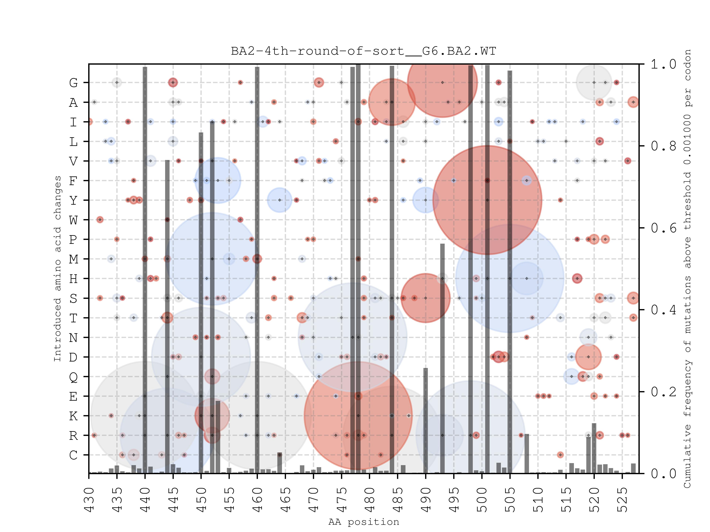
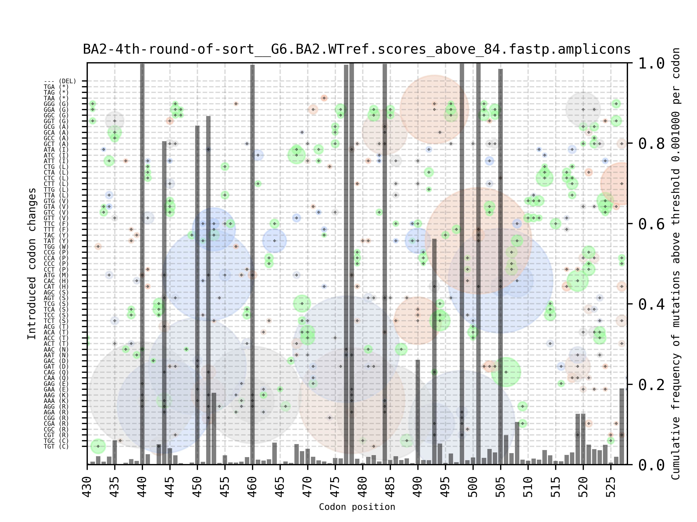

All figures we prepared for our new publication are at [https://host-patho-evo.github.io/mutation_scatter_plot](https://host-patho-evo.github.io/mutation_scatter_plot/).

## Example of a dynamic output of matplotlib window (with interactive features)

Once the interactive window is raised by matplotlib user can point the computer mouse to any circular object and a bubble with more detailed annotation is raised. Once the window is closed `mutation_scatter_plot` can continue and finish.

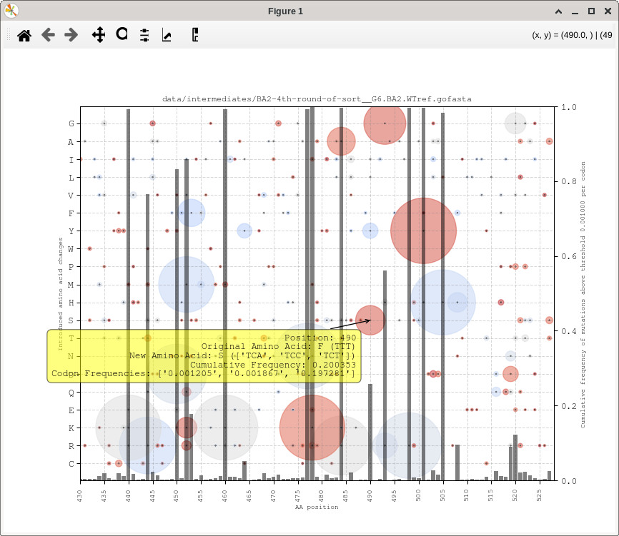
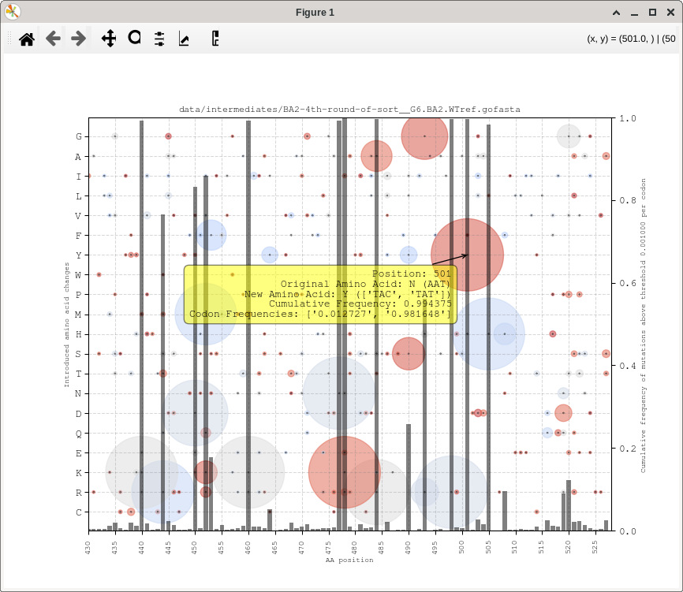
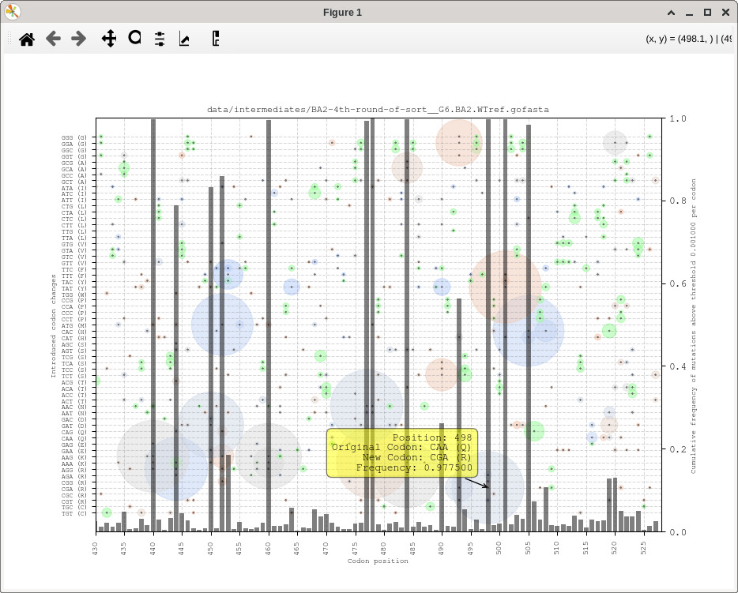
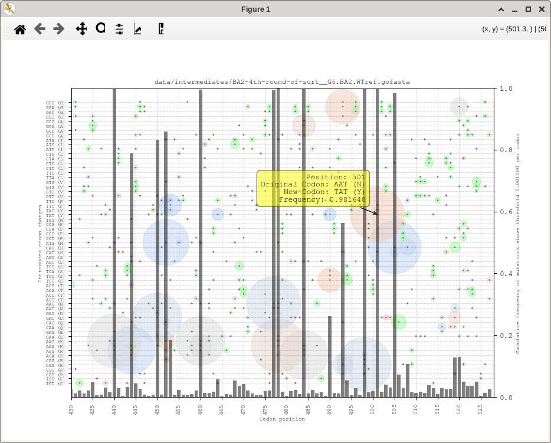
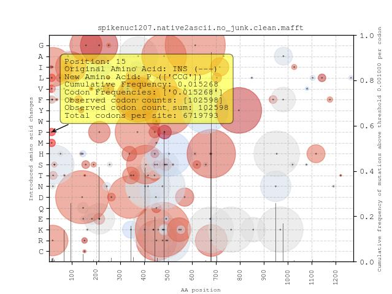
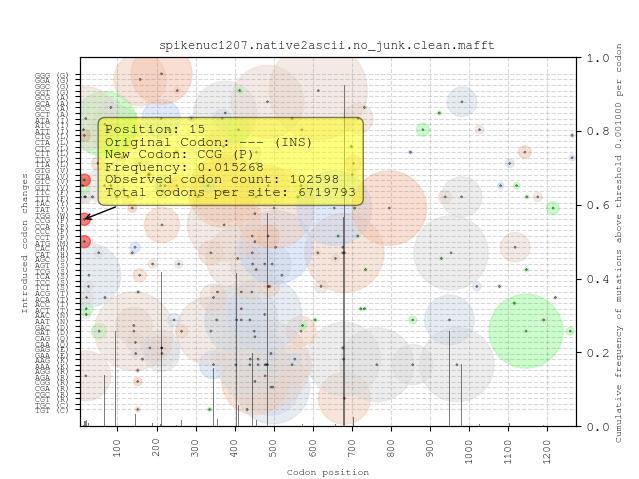
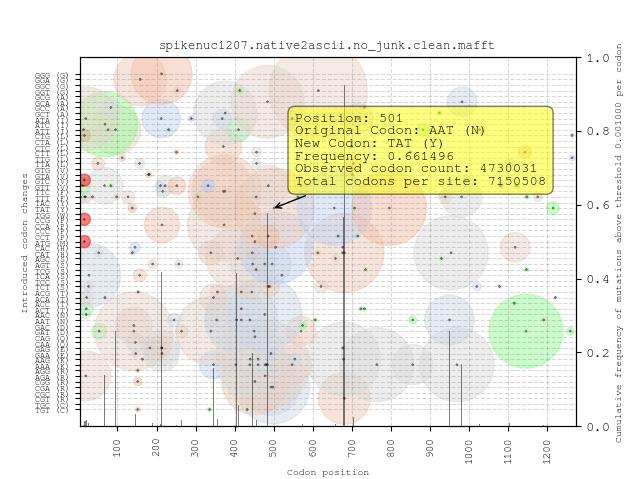
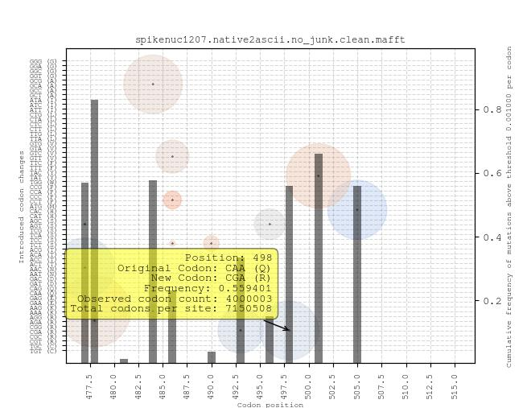
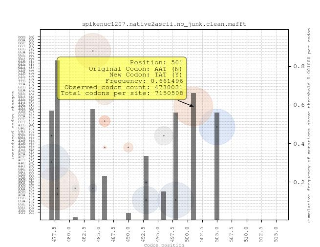
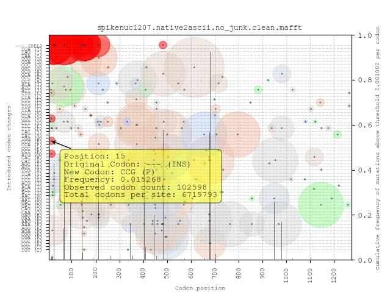
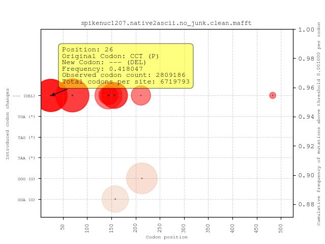
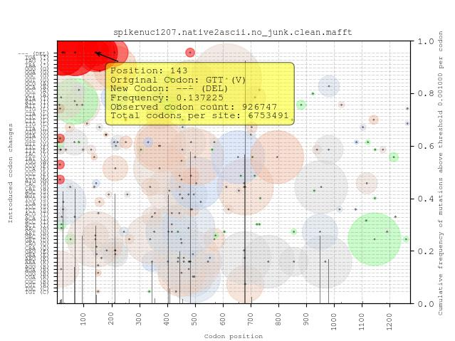
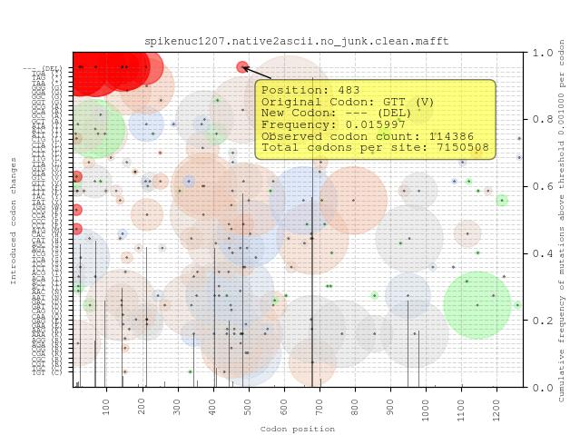


## Example of a dynamic output HTML pages with images (with interactive features)

The following were rendered by `mutation_scatter_plot`. They are not so visually appealing like the figures from matplotlib but they work in any www browser. The following figure is from Firefox.

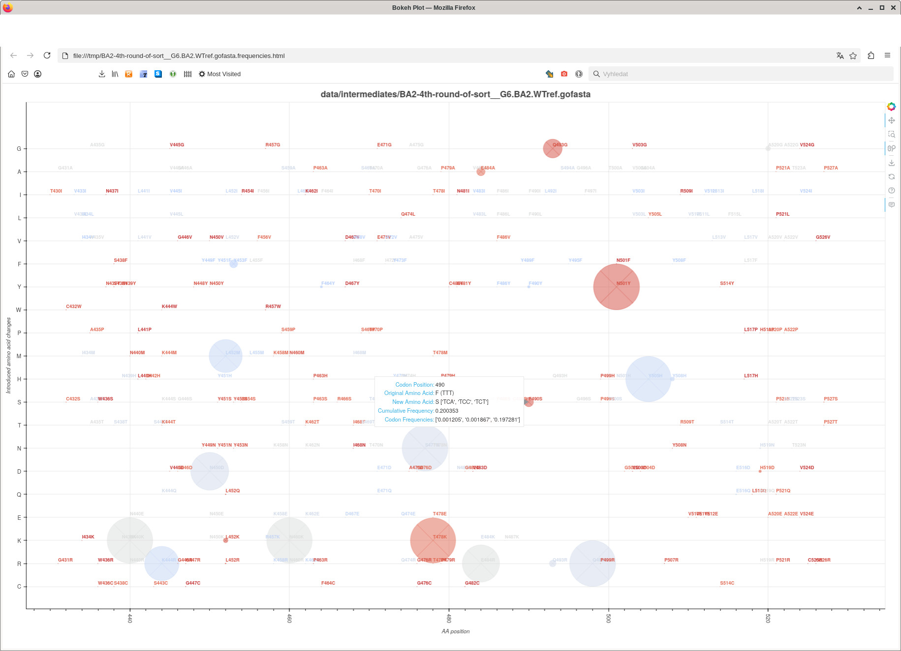
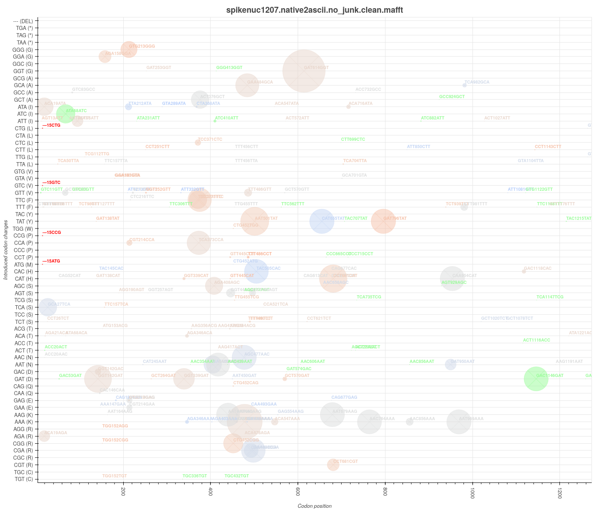

Browse the live HTML with Javascript file contents at:

[data/outputs/aa/html/BA2-4th-round-of-sort__G6.BA2.WTref.aa.frequencies.html](https://host-patho-evo.github.io/mutation_scatter_plot/aa/html/BA2-4th-round-of-sort__G6.BA2.WTref.aa.frequencies.html)

[data/outputs/codon/html/BA2-4th-round-of-sort__G6.BA2.WTref.codon.frequencies.html](https://host-patho-evo.github.io/mutation_scatter_plot/codon/html/BA2-4th-round-of-sort__G6.BA2.WTref.codon.frequencies.html)

#### Command line output

Both `calculate_codon_frequencies` and `mutation_scatter_plot` output some helpful _Info:_ text on their STDOUT. One can also enable `--debug` option with debugging level.

When matplotlib raises its interactive image window and user points the mouse pointer some circular object in the chart (triggering the mouse `hover()` event) the `mutation_scatter_plot` writes on the STDOUT the values parsed for the codon or amino acid, for example:

```
$ calculate_codon_frequencies --alignment-file tests/inputs/test2_full.fasta --outfile-prefix tests/outputs/test2_full.x_after_count.frequencies --padded-reference --reference-infile tests/inputs/MN908947.3_S_full.fasta --x-after-count --overwrite
Info: consensus = ACAGGCTGCGTTATAGCTTGGAATTCTAACAAGCTTGATTCTAAGGTTGGTGGTAATTATAATTACCTGTATAGATTGTTTAGGAAGTCTAATCTCAAACCTTTTGAGAGAGATATTTCAACTGAAATCTATCAGGCCGGTAACAAACCTTGTAATGGTGTTGCAGGTTTTAATTGTTACTTTCCTTTACAATCATATGGTTTCCGACCCACTTATGGTGTTGGTCACCAACCATACAGAGTAGTAGTACTTTCTTTTGAACTTCTACATGCACCAGCAACTGTTTGTGGACCTAAA
Info: Sample consensus sequence should roughly match substring inside the reference ATG---...
```

```
$ mutation_scatter_plot --tsv tests/outputs/test2_full.x_after_count.frequencies.tsv --outfile-prefix tests/outputs/test2_full.x_after_count.scatter_codons --show-STOP --show-X --show-DEL --show-INS --threshold=0.001
Info: Using BLOSUM80 matrix now. Theoretical minimum score is -6.0, theoretical maximum score is 11.0, values are {0.0, 1.0, 2.0, 3.0, 4.0, 5.0, 6.0, 7.0, 8.0, 9.0, 11.0, -1.0, -6.0, -5.0, -4.0, -3.0, -2.0}
Info: Parsing input file tests/outputs/test2_full.x_after_count.frequencies.tsv
Info: Autodetected new TSV file format with a header in tests/outputs/test2_full.x_after_count.frequencies.tsv
Info: The file tests/outputs/test2_full.x_after_count.frequencies.tsv contains now these columns: Index(['padded_position', 'position', 'original_aa', 'mutant_aa', 'frequency',
       'original_codon', 'mutant_codon', 'observed_codon_count',
       'total_codons_per_site'],
      dtype='object')
Info: Originally there were 23 rows but after discarding codons with [N n] there are only 21 left
Info: Writing into tests/outputs/test2_full.x_after_count.scatter_codons.actually_rendered.tsv
Info: Title will be tests/outputs/test2_full.x_after_count
Info: Writing into tests/outputs/test2_full.x_after_count.scatter_codons.codon.frequencies.colors.tsv
Info: The following values were collected from matrix BLOSUM80 based on the actual data (some values from matrix might not be needed for your data, hence are not listed here): [-6, -4, -3, -2, -1, 0, 1, 2] . Range spans 9 values (before symmetrization).
Info: Writing into tests/outputs/test2_full.x_after_count.scatter_codons.html
Info: Writing into tests/outputs/test2_full.x_after_count.scatter_codons.png, figure size is [16.  9.] inches and [1600.  900.] dpi
Info: Writing into tests/outputs/test2_full.x_after_count.scatter_codons.pdf, figure size is [16.  9.] inches and [1600.  900.] dpi

$ # Example hover output for position 498
Info: _padded_position=515, ypos=21
Info: _new_codon=CGA, _padded_position=515, _position_in_protein=498, _frequency=0.700161
Info: 1 aa residues observed in position 498:
       padded_position  position original_aa mutant_aa  frequency original_codon mutant_codon  observed_codon_count  total_codons_per_site
21                 515       498           Q         R   0.700161            CAA          CGA               1103909                1576651
```
`

## Command line arguments

```
$ calculate_codon_frequencies --help
Usage: calculate_codon_frequencies [options]

calculate_codon_frequencies — parse multi-FASTA alignments and calculate
codon/amino-acid frequencies per site relative to a reference sequence.

Please cite our article if you use our data or software in your work:

Shoshany A., Tian R., Padilla-Blanco M., Hruška A., Baxova K., Zoler E.,
Mokrejš M., Schreiber G., Zahradník J. (submitted) In Vitro and Viral
Evolution Convergence Reveal the Selective Pressures Driving Omicron
Emergence. https://www.biorxiv.org/content/10.1101/2025.04.23.650148v1


Options:
  --version             show program's version number and exit
  -h, --help            show this help message and exit
  --reference-infile=FILE
                        FASTA formatted input file with reference padded
                        sequence or not
  --padded-reference    By default we do NOT require the reference sequence to
                        be padded with '-' characters to match the alignment
                        delineating INSertions. If it is not padded [default
                        case] then INSertion will not be reported but gaps
                        parsed in the alignment will be skipped as long until
                        3 nucleotides are available for codon translation.
                        Regardless of this --padded-reference setting, length
                        of the reference sequence must match length of each
                        alignment line.
  --alignment-file=FILE
                        ALIGNMENT file in FASTA format with - (minus) chars to
                        adjust the alignment to the --reference-infile
  --outfile-prefix=FILE
                        It assumes *.frequencies.fasta files. The prefix
                        specified should end with .frequencies . The .tsv and
                        .unchanged_codons.tsv will be appended to the prefix.
  --left-reference-offset=LEFT_REFERENCE_OFFSET
                        First nucleotide of the ORF region of the REFERENCE of
                        interest to be sliced out from the input sequences.
                        This requires 0-based numbering.
  --right-reference-offset=RIGHT_REFERENCE_OFFSET
                        Last nucleotide of the last codon of the REFERENCE of
                        interest to be sliced out from the input sequences.
                        This requires 0-based numbering.
  --aa_start=AA_START   Adjust (padded) real position of the very first codon
                        unless (1 for an initiator ATG). This value is added
                        to the codon position reported in the output TSV file
                        (the ATG position minus one). Use this if you cannot
                        use --left-reference-offset nor --right-reference-offset
                        which would have been used for slicing the input
                        reference. The value provided is decremented by one to
                        match pythonic 0-based numbering.
  --min_start=MIN_START
                        Start parsing the alignment since this position of the
                        ALIGNMENT file. This requires 1-based numbering. This
                        is to speedup parsing of input sequences and of the
                        reference by skipping typical leading and trailing
                        padding dashes. Default: 0 (parse since the beginning)
  --max_stop=MAX_STOP   Stop parsing the alignment at this position of the
                        ALIGNMENT file. This requires 1-based numbering. This
                        is to speedup parsing of input sequences and of the
                        reference by skipping typical leading and trailing
                        padding dashes. Default: 0 (parse until the very end)
  --x-after-count       The FASTA file ID contains the count value followed by
                        lowercase 'x'
  --print-unchanged-sites
                        Print out also sites with unchanged codons in to
                        unchanged_codons.tsv file [default]
  --disable-print-unchanged-sites
                        Do NOT print out sites with unchanged codons to
                        unchanged_codons.tsv file
  --discard-this-many-leading-nucs=DISCARD_THIS_MANY_LEADING_NUCS
                        Specify how many offending nucleotides are at the
                        front of the FASTA sequences shifting the reading
                        frame of the input FASTA file from frame +1 to either
                        of the two remaining. Count the leading dashes and
                        eventual nucleotides of incomplete codons too and
                        check if it can be divided by 3.0 without slack. By
                        default reading frame +1 is expected and hence no
                        leading nucleotides are discarded. Default: 0
  --discard-this-many-trailing-nucs=DISCARD_THIS_MANY_TRAILING_NUCS
                        Specify how many offending nucleotides are at the end
                        of each sequence. Default: 0
  --minimum-alignments-length=MINIMUM_ALN_LENGTH
                        Minimum length of aligned NGS read to be used for
                        calculations
  --debug=DEBUG         Set debug level to some real number
  --overwrite           Overwrite existing output files instead of raising
                        RuntimeError
```

```
$ mutation_scatter_plot --help
Usage: mutation_scatter_plot [options]

Options:
  --version             show program's version number and exit
  -h, --help            show this help message and exit
  --tsv=TSV_FILE_PATH   Path to a TAB separated file with 5-columns: ['position', 'original_aa', 'mutant_aa', 'frequency', 'original_codon', 'mutant_codon', 'coverage_per_codon'] or more up to 11-columns ['padded_position', 'position', 'original_aa', 'mutant_aa', 'frequency', 'original_codon', 'mutant_codon', 'observed_codon_count', 'total_codons_per_site', 'frequency_parent', 'frequency_selected'] as we kept extending the file format
  --column=COLUMN_WITH_FREQUENCIES
                        Name of a column in input TSV to be used for rendering frequencies [frequency]
  --outfile-prefix=OUTFILE_PREFIX
                        Output file prefix, eventually also with path. Output files will be PNG, JPG or PDF, HTML
  --offset=OFFSET       Define offset value to be added to every amino acid position in the first column of the TSV input file at runtime. This is to obtain real amino acid position within the protein. Normally protein starts at position 1. Check the first aa in TSV file and provide whatever number to be added to it to get the desired amino acid position in the full-length protein.
  --xmin=XMIN           Define minimum X-axis value. This should be the position in the padded alignment (using '-').
  --xmax=XMAX           Define maximum X-axis value. This should be the position in the padded alignment (using '-').
  --x-axis-bins=XAXIS_BINS
                        Set number of bins (labels) on the X-axis. Could be used to override the amount of major ticks in a different way. Use 20 for example. [default is 0]
  --x-axis-major-ticks-spacing=XAXIS_MAJOR_TICKS_SPACING
                        Set distance between the major ticks on X-axis
  --x-axis-minor-ticks-spacing=XAXIS_MINOR_TICKS_SPACING
                        Set distance between the minor ticks on X-axis
  --x-axis-label-start=XAXIS_LABEL_START
                        Set first label value on the X-axis
  --aminoacids          Draw chart with amino acid residues on Y-axis instead of codons. [default is False]
  --show-STOP           Include STOP codons or '*' in charts on Y-axis. [default is False]
  --show-INS            Include INS in charts on Y-axis. [default is False]
  --show-DEL            Include DEL in charts on Y-axis. [default is False]
  --show-X              Include X in charts on Y-axis in --aminoacids mode. [default is False]
  --enable-colorbar     Enable colorbar [is Disabled by default]
  --disable-short-legend
                        Disable short legend in charts on X-axis. [is Enabled by default]
  --include-synonymous  Include synonymous changes in --aminoacids output as green diamonds. In codon output they are always shown. [default is False]
  --threshold=THRESHOLD
                        Define minimum frequency threshold to display a pictogram in the output. For codon mode use 0.001 and for aa mode use 0.01. [default: 0.001]
  --title=TITLE         Set title for the figures, by default trailing '.frequencies.tsv' is stripped from the end of the input filename
  --disable-2nd-Y-axis  Disable rendering of the 2nd Y-axis showing sequencing coverage
  --legend              Draw legend chart. [default is False]
  --matrix=MATRIX       BLOSUM matrix: BLOSUM45,BLOSUM50,BLOSUM62,BLOSUM80,BLOSUM90 [default is BLOSUM80]
  --matrix-file=MATRIX_FILE
                        Matrix file compatible with BLOSUM matrices, e.g. prot26050-sup-0004-Supinfo03.sm from https://www.ncbi.nlm.nih.gov/pmc/articles/PMC8641535/bin/NIHMS1664401-supplement-supinfo.rar if you do not like default BLOSUM62
  --colormap=COLORMAP   Pick a colormap recognized by matplotlib. See https://i.sstatic.net/cmk1J.png [default is coolwarm_r but seismic_r and coolwarm_r are great too]
  --dpi=DPI             DPI resolution for images
  --backend=BACKEND     Matplotlib backend to render resulting figures: agg, wxpython, pyqt5, pyqt6, pycairo, cairocffi [default: unset]
To disable Matplotlib interactive window being raised up you can set MPLBACKEND=agg env variable.
  --debug=DEBUG         Set debug to some real number
  --disable-bokeh-sqrt-size
                        Disable sqrt scaling for Bokeh circle sizes; size (diameter) will be proportional to frequency, area proportional to frequency². By default sqrt scaling is on, matching the perceptual appearance of the matplotlib figure.
  --show-invisible-placeholder-dots
                        Include below-threshold dots in the plot. [default: False]
```

```
$ count_motifs_in_sequences --help
Usage: count_motifs_in_sequences [options]

Options:
  --version             show program's version number and exit
  -h, --help            show this help message and exit
  --infilename=INFILENAME
                        Input FASTA/Q file path.
  --infile-format=INFILE_FORMAT
                        Input FASTA/Q file format [default: fasta]. Outfile is
                        always fasta.
  --motif=MOTIF         Protein or nucleotide motif to count. No REGEXPs
                        allowed (yet)
  --start-position=STARTPOS
                        Exact start position of the query
  --end-position=ENDPOS
                        Exact end position of the query
  --debug=DEBUG         Set debug to some value
```

```
$ alignment2dots --help
Usage: alignment2dots [options]

Options:
  --version             show program's version number and exit
  -h, --help            show this help message and exit
  --reference-infile=FILE
                        FASTA formatted input file with reference padded
                        sequence or not
  --alignment-file=FILE
                        FASTA formatted input file with padded sequence or not
  --aminoacids          FASTA formatted input files are protein sequences
                        instead of DNA [default: DNA]
  --outfilename=FILE    Output filename. If the filename ends with .tsv the
                        output lines will be split using TABs and original
                        FASTA ID will be on the same line with the split
                        sequence
  --aln_start=ALN_START
                        First nucleotide of the ORF region of interest to be
                        sliced out from the input sequences
  --aln_stop=ALN_STOP   Last nucleotide of the last codon of interest to be
                        sliced out from the input sequences
  --print-fasta-ids     The FASTA file ID should be printed for each aligned
                        entry
  --threshold=THRESHOLD
                        Set the minimum absolute count of different characters
                        in sequence to be output. Set this to 1 or higher if
                        you want to see at least 2 aa residues being changed
                        and in turn, do not want to see just dashes in some
                        cases for synonymous changes [default: 0].
  --relative_threshold=RELATIVE_THRESHOLD
                        Set the minimum relative incidence threshold of the
                        whole sequence hash. Maybe you want something like
                        0.001 [default: 0].
  --top_n=TOP_N         Write only first N entries containing some difference
                        [default: all]
  --debug=DEBUG         Set debug level to some real number
```

```
$ split_fasta_entries_by_lengths --help
Usage: split_fasta_entries_by_lengths [options]

Options:
  --version             show program's version number and exit
  -h, --help            show this help message and exit
  --infile=INFILE       Input FASTA/Q file path.
  --outfile-prefix=OUTFILE_PREFIX
                        Output file path prefix.
  --full-length=FULL_LENGTH
                        Full length required for perfect alignment [0]
  --format=FORMAT       Input file format.
  --debug=DEBUG         Set debug to some value
```

## Version 0.2 supports DELetions and INSertions relative to the (padded) reference sequence

We further improved the software to be able to report DELetions and INSertions appearing in sample data (multiple-sequence alignment). The `calculate_codon_frequencies` now also reports total counts of reads covering each codon (per-site coverage) in additional columns 8 and 9 of the TSV output file. The more detailed file can be parsed by `mutation_scatter_plot`. Another significant change was the requirement for padded alignment at input which must have exactly same length as the reference (which might need to be padded as well). To observe DELetions in the sample sequence one does not need to adjust the reference sequence, because in the aligned sample sequence will be just `---` for a DELeted codon. Obviously, if an INSertion is to be reflected in the sample sequence, the reference sequence must be inflated by paddings. The reason for that is that we use a pairwise NCBI blastn to create the alignment and do not create a multiple-sequence alignment at all (the hints mentioning `gofasta` are now removed).


## Citation

Please cite the following article if you use our data or software in your research:

Shoshany A., Tian R., Padilla-Blanco M., Hruška A., Baxova K., Zoler E., Mokrejš M., Schreiber G., Zahradník J. (submitted) In Vitro and Viral Evolution Convergence Reveal the Selective Pressures Driving Omicron Emergence. [bioRxiv](https://www.biorxiv.org/content/10.1101/2025.04.23.650148v1)


## Website

https://github.com/host-patho-evo/mutation_scatter_plot


## License

This work © 2025 by Jiří Zahradník and Martin Mokrejš (First Medical Faculty - Charles University in Prague) is licensed under Creative Commons Attribution 4.0 International (CC BY 4.0). To view a copy of this license, visit https://creativecommons.org/licenses/by/4.0/


## Acknowledgements
[This project was supported by the National Institute of Virology and Bacteriology (Programme EXCELES, LX22NPO5103) - funded by the European Union - NextGenerationEU](https://nivb.cz/en/)

Funded by the European Union NextGenerationEU -- Czech Recovery Plan -- Ministry of Education, Youth and Sports
