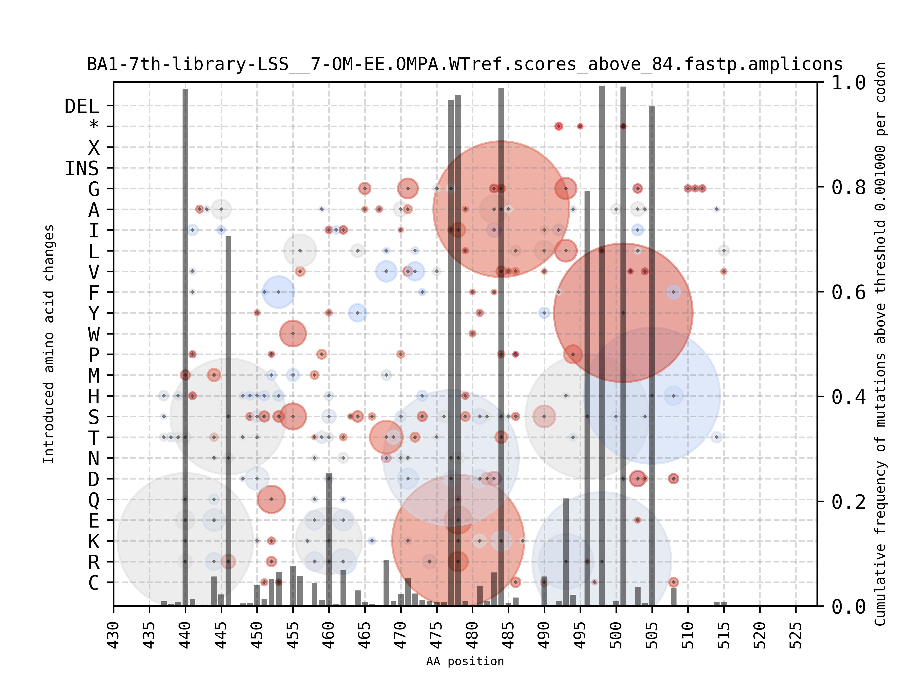

**Calculate in each position frequency of codons and amino acids from a multiple sequence alignment and draw an interactive scatter plot**

The scripts and data contained in this folder are for a **Convergence of Directed and Viral Evolution Reveals the Selective Pressures Driving Omicron Emergence** publication by Shoshany et al. (submitted 2025). Additional data can be found at DOI:10.5281/zenodo.15102607 .

There are two programs.
`calculate_codon_frequencies.py` takes a multiple sequence alignment file and calculates frequencies of the codons. It parses a reference nucleotide sequence of the respective protein to stay in the reading frame (only reading frame +1 is supported). Therefore it is best to map sequencing reads to a ORF sequence encoding the protein although only part of it may have been studied. When this is followed the nucleotide or amino acid positions can be easily calculated from the padding with dashes ('-') in a multi-FASTA 2-line file.

`mutation_scatter_plot.py` when run on a graphical terminal it opens an interactive matplotlib window with the figures. After closing the interactive window it also outputs files in JPG, PNG and PDF format. Also JSON and an interactive HTML+javascript output files are created.

Interactive figures can be visualized and individual frequencies of mutations inspected using python with [matplotlib](https://matplotlib.org/) and [mplcursors](https://pypi.org/project/mplcursors/) installed and concurrently, interactive HTML files are rendered thanks to [Bokeh](https://bokeh.org/).


**Prerequisities**

A Run the application on your local computer

A.1 Install necessary python tools using pip

```
pip install biopython
pip install blosum
pip install pandas
pip install mplcursors
pip install bokeh
```

To yield interactive figures one of the following backends must be installed

```
pip install wxpython
pip install pyqt5
pip install pyqt6
pip install pycairo
pip install cairocffi
```

A.2 Install necessary python tools using conda

```
conda create -n mutation_scatter_plot
conda install biopython
conda install blosum
conda install pandas
conda install mplcursors
conda install bokeh
```

To yield interactive figures one of the following backends must be installed

```
conda install 
conda install 
conda install 
```


The mplcursors `hover()` works under the following backends:

`export MPLBACKEND=gtk3cairo`
`export MPLBACKEND=wxagg`
`export MPLBACKEND=qtagg`
`export MPLBACKEND=gtk4agg`
`export MPLBACKEND=tkagg # is rather slow`

The following starts a tornado webserver on a localhost but you do not need it because the script renders interactive HTML with with javascript inside:
`export MPLBACKEND=webagg`


To disable interactive matplotlib figures raised on your X11/Wayland display (interactive HTML with with javascript inside are still rendered) use:
`export MPLBACKEND=agg`.


**Usage**

```
prefix='WT-7th-library-LSS__7-WU-FF.WUPA.WTref'
mutation_scatter_plot.py --xmin 340 --xmax 516 --tsv "$prefix".frequencies.tsv --outfile "$prefix".aa.frequencies.png --aminoacids
mutation_scatter_plot.py --xmin 340 --xmax 516 --tsv "$prefix".frequencies.tsv --outfile "$prefix".codon.frequencies.png
count_motifs_in_sequences.py --infilename="$prefix".scores_above_84.fastp.amplicons.clean.prot.counts.fasta --motif=RPTY
```

**Examples**




All figures we prepared for our new publication are at [https://host-patho-evo.github.io/mutation_scatter_plot](https://host-patho-evo.github.io/mutation_scatter_plot/).


**Citation**

Please cite the following article if you use our data or software in your research:

Shoshany A., Tian R., Padilla-Blanco M., Hruška A., Baxova K., Zoler E., Mokrejš M., Schreiber G., Zahradník J. (submitted) Convergence of Directed and Viral Evolution Reveals the Selective Pressures Driving Omicron Emergence.


**Website**

https://github.com/host-patho-evo/mutation_scatter_plot
