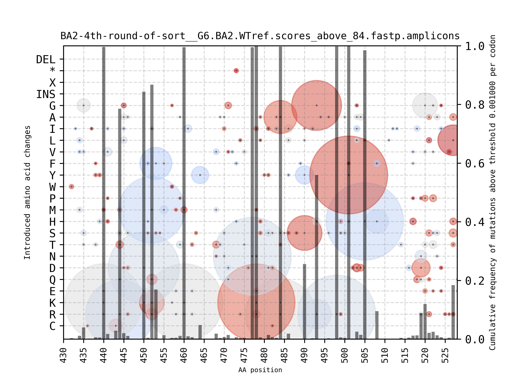

## Calculate in each position frequency of codons and amino acids from a multiple sequence alignment and draw an interactive scatter plot

The scripts and data contained in this folder are for a **In Vitro and Viral Evolution Convergence Reveal the Selective Pressures Driving Omicron Emergence** publication by Shoshany et al. (submitted, see [bioRxiv](https://www.biorxiv.org/content/10.1101/2025.04.23.650148v1)). Original input data, calculated frequencies in TSV files and also the ready-made figures in JPG/PNG/PDF/HTML+Javascript can be found at [DOI:10.5281/zenodo.17108067](https://zenodo.org/records/17108067) meanwhile. One does not need to install these two utilities to study the results. However, we provide our code to facilitate similar studies of other datasets.

We developed two programs.
`calculate_codon_frequencies.py` takes a multiple sequence alignment file in a FASTA format (possibly padded with `-` as gaps) and calculates frequencies of the codons. It parses a reference nucleotide sequence of the respective protein to stay in the reading frame (only reading frame +1 is supported). Therefore it is best to map sequencing reads to a complete open reading frame (ORF) sequence encoding the protein (incl. START and STOP codons) although only part of it may have been studied. When this is followed the nucleotide or amino acid positions can be easily calculated from the padding with dashes (`-`) in a multi-FASTA 2-line file. Otherwise the program allows to specify an arbitrary offset to output native coordinates despite short sequence provided.

`mutation_scatter_plot.py` when run on a graphical terminal opens an interactive matplotlib window with the figures. One can use computer mouse to `hover()` the bubbles to see detailed annotation. After closing the interactive window it also outputs files in JPG, PNG and PDF format and finally also JSON and an interactive HTML+javascript output files are created. One can disable the interactive matplotlib window being raised by adjusting the `MPLBACKEND` environment variable (read further below).

Interactive figures can be visualized and individual frequencies of mutations inspected using python with [matplotlib](https://matplotlib.org/) and [mplcursors](https://pypi.org/project/mplcursors/) installed and concurrently, interactive HTML files are rendered thanks to [Bokeh](https://bokeh.org/).


## System requirements

One does not really need to install the two `python3`-based programs but their standard python dependencies must be available on the execution host. Any `python-3.10` or never will work fine. We use python-3.11 and 3.12. Provided `blosum` and `Bokeh` packages are not included in standard Debian packages we recommended to install them via pip` (see A.2 route below) or `conda` (see A.3 route below) into a `python3`-based virtual environment.

We developed the software using the following versions:
```
>=python-3.10
>=biopython-1.81
>=matplotlib-3.8.4
>=mplcursors-0.5.3
>=pandas-2.2.2
>=numpy-2.2.5
>=blosum-2.0.3
>=bokeh-3.7.2
```

We tested these two package management implementations providing same functionality:
```
>=conda-24.11.3
>=virtualenv-20.25.1
```

**Installation of dependencies**

You can copy&paste the commands shown below so the installation of the requirements should take few dozens of seconds. Follow either A.2 or A.3 route as they are the simplest. If you are one Debian-based system you can follow a mix of A.1 but then continue with either A.2 or A.3 installation procedure to install the missing packages.

**A.1 Install some of the necessary python tools using apt on a Debian-based Linux host**
```
apt-get install python3-biopython
apt-get install python3-pandas
apt-get install python3-mplcursors
```

Further you need to install [blosum](https://github.com/not-a-feature/blosum) and [Bokeh](https://docs.bokeh.org/en/latest/docs/first_steps.html#first-steps-installing) packages via either `pip` (ideally into a virtual environment) or `conda` (follow either of the following procedures).

**A.2 Install all necessary python tools using pip**

```
cd $HOME
mkdir -p .virtualenvs && cd .virtualenvs
virtualenv mutation_scatter_plot
. ~/.virtualenv/mutation_scatter_plot/bin/activate
pip install biopython
pip install blosum
pip install numpy
pip install pandas
pip install mplcursors
pip install bokeh
```

Later you can re-enter this virtual environment by `. ~/.virtualenvs/mutation_scatter_plot/bin/activate` command.

To yield interactive figures one of the following backends must be installed

```
pip install wxpython
pip install pyqt5
pip install pyqt6
pip install pycairo
pip install cairocffi
```

**A.3 Install all necessary python tools using conda**

Conda creates its own virtual environment so 
```
conda create -n mutation_scatter_plot
conda activate mutation_scatter_plot
conda install biopython
conda install blosum
conda install numpy
conda install pandas
conda install mplcursors
conda install bokeh
```

To yield interactive figures one of the following backends must be installed/enabled in your matplotlib. Just test which `MPLBACKEND` value works for you best. Most likely some of these backends are already enabled on your system. Matplotlib will pick any available automatically. For the wxagg backend probably `wxpython` must be installed. Most users will not need to set this variable and force the switch to a non-default backend. But just in case ...

```
conda install wxpython
```

You can leave the conda environment by `conda deactivate` command.

Later you can re-enter this environment by `conda activate mutation_scatter_plot` command.


## Usage

Download the release which works with vanilla biopython:

```
wget https://github.com/host-patho-evo/mutation_scatter_plot/archive/refs/tags/v0.1.zip
unzip v0.1.zip
```

The mplcursors `hover()` works under the following backends. Pick just a single command from the following:

```
export MPLBACKEND=gtk3cairo
export MPLBACKEND=wxagg
export MPLBACKEND=qtagg
export MPLBACKEND=gtk4agg
export MPLBACKEND=tkagg # is rather slow
```

The following starts a tornado webserver on a localhost but you do not need it because the script renders interactive HTML with with javascript inside:
```
export MPLBACKEND=webagg
```


To disable interactive matplotlib figures raised on your X11/Wayland display (interactive HTML with with javascript inside are still rendered) use:
```
export MPLBACKEND=agg
```

Below we explain what happens further upon the execution. Not only there is helpful information reported on STDOUT but also a web browser is opened (or a TAB in an existing browser is opened with the HTML+Javascript interactivity) but also an interactive Matplotlib window is opened. Once the Matplotliob window is closed the `mutation_scatter_plot.py` can finish. In the next paragraphs we describe some of these steps in more detail.

**Simple Testcase to calculate codon frequencies and to render the figures**

One can calculate the codon frequencies from a provided FASTA input file. The sequence must be in frame +1. In version 0.1 the padding dashes `-` are ignored and the software keeps fetches next() nucleotides as long until there are three nucleotides representing the codon to be translated. In the `main` branch there is now a version which requires the inut sequence to be fully aligned to codons. 

```
python3 calculate_codon_frequencies.py --reference-infile=tests/inputs/MN908947.3_S.fasta --alignment-file=tests/inputs/test.fasta \
    --outfile-prefix=tests/outputs/test.frequencies --min_start=1 --max_stop=3873 --print-unchanged-sites --x-after-count --padded-reference

prefix='tests/outputs/test.frequencies'
mutation_scatter_plot.py --xmin 340 --xmax 516 --tsv "$prefix".frequencies.tsv --outfile "$prefix".aa.frequencies.png --aminoacids
mutation_scatter_plot.py --xmin 340 --xmax 516 --tsv "$prefix".frequencies.tsv --outfile "$prefix".codon.frequencies.png
```

**More complex testing**
```
calculate_codon_frequencies.py --reference-infile=MN908947.3_S.fasta --alignment-file=test5.amplicons.clean.counts.filtered.fasta --outfile-prefix=test5.amplicons.frequencies --left-reference-offset=1288 --right-reference-offset=1584 --min_start=1288 --max_stop=1584 --print-unchanged-sites --x-after-count --padded-reference

calculate_codon_frequencies.py --reference-infile=MN908947.3_S.fasta --alignment-file=test6.amplicons.clean.counts.filtered.fasta --outfile-prefix=test6.amplicons.frequencies --left-reference-offset=1288 --right-reference-offset=1584 --min_start=1288 --max_stop=1584 --print-unchanged-sites --x-after-count --padded-reference

calculate_codon_frequencies.py --reference-infile=MN908947.3_S.fasta --alignment-file=test6.amplicons.clean.counts.filtered.fasta --outfile-prefix=test7.amplicons.frequencies --left-reference-offset=1297 --right-reference-offset=1584 --min_start=1297 --max_stop=1584 --print-unchanged-sites --x-after-count --padded-reference

calculate_codon_frequencies.py --reference-infile=MN908947.3_S.fasta --alignment-file=test6.amplicons.clean.counts.filtered.fasta --outfile-prefix=test8.amplicons.frequencies --print-unchanged-sites --x-after-count --padded-reference

diff -u -w tests/outputs/test5.amplicons.frequencies.tsv test5.amplicons.frequencies.tsv
diff -u -w tests/outputs/test5.amplicons.frequencies.tsv test6.amplicons.frequencies.tsv # you should see some DELetion events for codons 430, 431, 432
diff -u -w tests/outputs/test5.amplicons.frequencies.tsv test7.amplicons.frequencies.tsv # you should see lines starting with 430, 431 and 432 are gone because first 9 nulecotides were skipped when parsing the alignment
diff -u -w tests/outputs/test6.amplicons.frequencies.tsv test8.amplicons.frequencies.tsv # you should see NO DIFFERENCE

```


**More realistic usage example**

Although we provide already the input, intermediate and resulting files in their respective ZIP bundles for download, to repeat the work or process other data one can take the following procedure to re-create our results. Download real data from [Zenodo https://doi.org/10.5281/zenodo.17108067](https://zenodo.org/records/17108067/files/per_sample_observed_codon_frequencies.zip?download=1). Unpack the ZIP file and pick any from the TSV files, for example `data/intermediates/BA2-4th-round-of-sort__G6.BA2.WTref.frequencies.tsv`.

```
curl -o per_sample_observed_codon_frequencies.zip "https://zenodo.org/records/17108067/files/per_sample_observed_codon_frequencies.zip?download=1"
unzip per_sample_observed_codon_frequencies.zip
prefix='BA2-4th-round-of-sort__G6.BA2.WTref'
mkdir -p data/outputs/aa/
mkdir -p data/outputs/codon/
mutation_scatter_plot.py --xmin 430 --xmax 528 --tsv data/intermediates/"$prefix".frequencies.tsv --outfile data/outputs/aa/"$prefix".aa.frequencies.png --aminoacids
mutation_scatter_plot.py --xmin 430 --xmax 528 --tsv data/intermediates/"$prefix".frequencies.tsv --outfile data/outputs/codon/"$prefix".codon.frequencies.png
```

We also provide a utility to count motifs in [per_sample_unique_sequence_counts_in_FASTA.zip](https://zenodo.org/records/17108067/files/per_sample_unique_sequence_counts_in_FASTA.zip?download=1)
```
curl -o per_sample_unique_sequence_counts_in_FASTA.zip "https://zenodo.org/records/17108067/files/per_sample_unique_sequence_counts_in_FASTA.zip?download=1"
unzip per_sample_unique_sequence_counts_in_FASTA.zip
count_motifs_in_sequences.py --infilename=data/intermediates/"$prefix".scores_above_84.fastp.amplicons.clean.prot.counts.fasta --motif=RPTY
```

## Run times

The runtime of `calculate_codon_frequencies.py` depends on the number of sequences in the input. To process ~350nt wide amplicon regions of ~200k sequences we needed several hours on a 2.3GHz machine (in a single thread). However, typicaly one can provide only unique sequences with their counts in the FASTA ID (for example `>100x` as the FASTA identifier) and then it takes just minutes to do all the processing.

The runtime of `mutation_scatter_plot.py` is a few minutes per dataset when all figure types are to be rendered on a 2.3GHz machine (in a single thread).


## Example static output images (without interactive features)

The following were rendered by `mutation_scatter_plot.py`:



All figures we prepared for our new publication are at [https://host-patho-evo.github.io/mutation_scatter_plot](https://host-patho-evo.github.io/mutation_scatter_plot/).

## Example of a dynamic output of matplotlib window (with interactive features)

Once the interactive window is raised by matplotlib user can point the computer mouse to any circular object and a bubble with more detailed annotation is raised. Once the window is closed `mutation_scatter_plot.py` can continue and finish.


## Example of a dynamic output HTML pages with images (with interactive features)

The following were rendered by `mutation_scatter_plot.py`. They are not so visually appealing like the figures from matplotlib but they work in any www browser. The following figure is from Firefox.


Browse the live HTML with Javascript file contents at:

[data/outputs/aa/html/BA2-4th-round-of-sort__G6.BA2.WTref.aa.frequencies.html](https://host-patho-evo.github.io/mutation_scatter_plot/aa/html/BA2-4th-round-of-sort__G6.BA2.WTref.aa.frequencies.html)

[data/outputs/codon/html/BA2-4th-round-of-sort__G6.BA2.WTref.codon.frequencies.html](https://host-patho-evo.github.io/mutation_scatter_plot/codon/html/BA2-4th-round-of-sort__G6.BA2.WTref.codon.frequencies.html)

## Command line output

Both `calculate_codon_frequencies.py` and `mutation_scatter_plot.py` output some helpful _Info:_ text on their STDOUT. One can also enable `--debug` option with debugging level.

When matplotlib raises its interactive image window and user points the mouse pointer some circular object in the chart (triggering the mouse `hover()` event) the `mutation_scatter_plot.py` writes on the STDOUT the values parsed for the codon or amino acid, for example:

```
$ mutation_scatter_plot.py --xmin 430 --xmax 528 --tsv  data/intermediates/BA2-4th-round-of-sort__G6.BA2.WTref.frequencies.tsv --outfile /tmp/BA2-4th-round-of-sort__G6.BA2.WTref.codon.frequencies.png 
Info: Using BLOSUM62 now. Minimum score is -4, maximum score is 11
Info: Parsing input file data/intermediates/BA2-4th-round-of-sort__G6.BA2.WTref.frequencies.tsv
Info: Autodetected old TSV file format without a header in data/intermediates/BA2-4th-round-of-sort__G6.BA2.WTref.frequencies.tsv, assigning default column names
Info: The file data/intermediates/BA2-4th-round-of-sort__G6.BA2.WTref.frequencies.tsv contains these columns: Index(['position', 'original_aa', 'mutant_aa', 'frequency', 'original_codon',
       'mutant_codon'],
      dtype='object')
Info: Originally there were 3484 rows but after discarding codons with [N n DEL] there are only 2787 left
Info: Writing into data/intermediates/BA2-4th-round-of-sort__G6.BA2.WTref.frequencies.actually_rendered.tsv
Info: Title will be data/intermediates/BA2-4th-round-of-sort__G6.BA2.WTref
Debug: final_sorted_whitelist=[('TGT', 'C'), ('TGC', 'C'), ('CGT', 'R'), ('CGC', 'R'), ('CGA', 'R'), ('CGG', 'R'), ('AGA', 'R'), ('AGG', 'R'), ('AAA', 'K'), ('AAG', 'K'), ('GAA', 'E'), ('GAG', 'E'), ('CAA', 'Q'), ('CAG', 'Q'), ('GAT', 'D'), ('GAC', 'D'), ('AAT', 'N'), ('AAC', 'N'), ('ACT', 'T'), ('ACC', 'T'), ('ACA', 'T'), ('ACG', 'T'), ('TCT', 'S'), ('TCC', 'S'), ('TCA', 'S'), ('TCG', 'S'), ('AGT', 'S'), ('AGC', 'S'), ('CAT', 'H'), ('CAC', 'H'), ('ATG', 'M'), ('CCT', 'P'), ('CCC', 'P'), ('CCA', 'P'), ('CCG', 'P'), ('TGG', 'W'), ('TAT', 'Y'), ('TAC', 'Y'), ('TTT', 'F'), ('TTC', 'F'), ('GTT', 'V'), ('GTC', 'V'), ('GTA', 'V'), ('GTG', 'V'), ('TTA', 'L'), ('TTG', 'L'), ('CTT', 'L'), ('CTC', 'L'), ('CTA', 'L'), ('CTG', 'L'), ('ATT', 'I'), ('ATC', 'I'), ('ATA', 'I'), ('GCT', 'A'), ('GCC', 'A'), ('GCA', 'A'), ('GCG', 'A'), ('GGT', 'G'), ('GGC', 'G'), ('GGA', 'G'), ('GGG', 'G')]
Debug: codons_whitelist2=['TGT', 'TGC', 'CGT', 'CGC', 'CGA', 'CGG', 'AGA', 'AGG', 'AAA', 'AAG', 'GAA', 'GAG', 'CAA', 'CAG', 'GAT', 'GAC', 'AAT', 'AAC', 'ACT', 'ACC', 'ACA', 'ACG', 'TCT', 'TCC', 'TCA', 'TCG', 'AGT', 'AGC', 'CAT', 'CAC', 'ATG', 'CCT', 'CCC', 'CCA', 'CCG', 'TGG', 'TAT', 'TAC', 'TTT', 'TTC', 'GTT', 'GTC', 'GTA', 'GTG', 'TTA', 'TTG', 'CTT', 'CTC', 'CTA', 'CTG', 'ATT', 'ATC', 'ATA', 'GCT', 'GCC', 'GCA', 'GCG', 'GGT', 'GGC', 'GGA', 'GGG']
Info: matplotlib.get_backend=qtagg
Info: Writing into data/intermediates/BA2-4th-round-of-sort__G6.BA2.WTref.codon.frequencies.colors.tsv
Info: Writing into /tmp/BA2-4th-round-of-sort__G6.BA2.WTref.codon.frequencies.html
Info: Writing into /tmp/BA2-4th-round-of-sort__G6.BA2.WTref.codon.frequencies.png
Info: Writing into /tmp/BA2-4th-round-of-sort__G6.BA2.WTref.codon.frequencies.jpg
Info: Writing into /tmp/BA2-4th-round-of-sort__G6.BA2.WTref.codon.frequencies.pdf
Info: xpos=498, ypos=4, _calculated_aa_offset=431
Info: position_in_protein=498, frequency=0.97750000000000003552713678800500929355621337890625
Info: 28 aa residues observed in position 498:
       position original_aa mutant_aa  frequency original_codon mutant_codon
2458       498           Q         K   0.000002            CAA          AAA
2459       498           Q         T   0.000011            CAA          ACA
2460       498           Q         R   0.010990            CAA          AGA
2461       498           Q         R   0.000218            CAA          AGG
2463       498           Q         S   0.000009            CAA          AGT
2464       498           Q         I   0.000016            CAA          ATA
2465       498           Q         Q   0.000001            CAA          CAG
2466       498           Q         H   0.000002            CAA          CAT
2467       498           Q         P   0.000418            CAA          CCA
2468       498           Q         P   0.000001            CAA          CCG
2469       498           Q         P   0.000004            CAA          CCT
2470       498           Q         R   0.977500            CAA          CGA
2471       498           Q         R   0.000348            CAA          CGC
2472       498           Q         R   0.002592            CAA          CGG
2474       498           Q         R   0.005219            CAA          CGT
2476       498           Q         L   0.000418            CAA          CTA
2477       498           Q         L   0.000002            CAA          CTC
2478       498           Q         L   0.000002            CAA          CTG
2479       498           Q         L   0.000007            CAA          CTT
2480       498           Q         E   0.000001            CAA          GAA
2481       498           Q         A   0.000017            CAA          GCA
2482       498           Q         G   0.000560            CAA          GGA
2483       498           Q         G   0.000002            CAA          GGG
2484       498           Q         G   0.000013            CAA          GGT
2485       498           Q         V   0.000007            CAA          GTA
2486       498           Q         V   0.000001            CAA          GTT
2490       498           Q         W   0.000005            CAA          TGG
2491       498           Q         L   0.000001            CAA          TTA
Info: xpos=501, ypos=36, _calculated_aa_offset=431
Info: position_in_protein=501, frequency=0.98164799999999996504840282796067185699939727783203125
Info: 28 aa residues observed in position 501:
       position original_aa mutant_aa  frequency original_codon mutant_codon
2564       501           N         K   0.000016            AAT          AAA
2565       501           N         N   0.000007            AAT          AAC
2566       501           N         K   0.000001            AAT          AAG
2567       501           N         T   0.000002            AAT          ACT
2568       501           N         I   0.000001            AAT          ATA
2569       501           N         I   0.000001            AAT          ATC
2570       501           N         I   0.000005            AAT          ATT
2571       501           N         H   0.001372            AAT          CAT
2572       501           N         P   0.000001            AAT          CCT
2573       501           N         R   0.000001            AAT          CGT
2574       501           N         L   0.000001            AAT          CTT
2575       501           N         D   0.000003            AAT          GAC
2576       501           N         E   0.000001            AAT          GAG
2577       501           N         D   0.000059            AAT          GAT
2578       501           N         A   0.000001            AAT          GCG
2579       501           N         V   0.000001            AAT          GTC
2580       501           N         V   0.000001            AAT          GTT
2583       501           N         Y   0.012727            AAT          TAC
2586       501           N         Y   0.981648            AAT          TAT
2587       501           N         S   0.000001            AAT          TCA
2588       501           N         S   0.000001            AAT          TCC
2589       501           N         S   0.000001            AAT          TCG
2590       501           N         S   0.000626            AAT          TCT
2591       501           N         C   0.000091            AAT          TGT
2593       501           N         L   0.000003            AAT          TTA
2594       501           N         F   0.000005            AAT          TTC
2595       501           N         L   0.000001            AAT          TTG
2596       501           N         F   0.001463            AAT          TTT
Info: Writing into /tmp/BA2-4th-round-of-sort__G6.BA2.WTref.codon.frequencies.legend.png
```

## Command line arguments

```
$ python calculate_codon_frequencies.py --help
Usage: calculate_codon_frequencies.py [options]

Options:
  -h, --help            show this help message and exit
  --reference-infile=FILE
                        FASTA formatted input file with reference padded
                        sequence or not
  --padded-reference    By default we do NOT require the reference sequence to
                        be padded with '-' characters to match the alignment
                        delineating INSertions. If it is not padded [default
                        case] then INSertion will not be reported but gaps
                        parsed in the alignment will be skipped as long until
                        3 nucleotides are available for codon translation.
                        Regardless of this --padded-reference setting, length
                        of the reference sequence must match length of each
                        alignment line.
  --alignment-file=FILE
                        Alignment file in FASTA format with - (minus) chars to
                        adjust the alignment to the --reference-infile
  --outfile-prefix=FILE
                        It assumes *.frequencies.fasta files. The prefix
                        specified should end with .frequencies . The .tsv and
                        .unchanged_codons.tsv will be appended to the prefix.
  --left-reference-offset=LEFT_REFERENCE_OFFSET
                        First nucleotide of the ORF region of the REFERENCE of
                        interest to be sliced out from the input sequences.
                        This requires 0-based numbering.
  --right-reference-offset=RIGHT_REFERENCE_OFFSET
                        Last nucleotide of the last codon of the REFERENCE of
                        interest to be sliced out from the input sequences.
                        This requires 0-based numbering.
  --aa_start=AA_START   Real position of the very first codon unless (1 for an
                        initiator ATG). This value is added to the codon
                        position reported in the output TSV file (the ATG
                        position minus one). Use this if you cannot use
                        --left-reference-offset nor --right-reference-offset
                        which would have been used for slicing the input
                        reference. The value provided is decremented by one to
                        match pythonic 0-based numbering.
  --min_start=MIN_START
                        Start parsing the alignment since this position of the
                        amplicon region. This requires 1-based numbering. This
                        is to speedup parsing of input sequences and of the
                        reference by skipping typical leading and trailing
                        padding dashes. Default: 0 (parse since the beginning)
  --max_stop=MAX_STOP   Stop parsing the alignment at this position of the
                        amplicon region. This requires 1-based numbering. This
                        is to speedup parsing of input sequences and of the
                        reference by skipping typical leading and trailing
                        padding dashes. Default: 0 (parse until the very end)
  --x-after-count       The FASTA file ID contains the count value followed by
                        lowercase 'x'
  --print-unchanged-sites
                        Print out also sites with unchanged codons in to
                        unchanged_codons.tsv file
  --discard-this-many-leading-nucs=DISCARD_THIS_MANY_LEADING_NUCS
                        Specify how many offending nucleotides are at the
                        front of the FASTA sequences shifting the reading
                        frame of the input FASTA file from frame +1 to either
                        of the two remaining. Count the leading dashes and
                        eventual nucleotides of incomplete codons too and
                        check if it can be divided by 3.0 without slack. By
                        default reading frame +1 is expected and hence no
                        leading nucleotides are discarded. Default: 0
  --discard-this-many-trailing-nucs=DISCARD_THIS_MANY_TRAILING_NUCS
                        Specify how many offending nucleotides are at the end
                        of each sequence. Default: 0
  --minimum-alignments-length=MINIMUM_ALN_LENGTH
                        Minimum length of aligned NGS read to be used for
                        calculations
  --debug=DEBUG         Set debug level to some real number
$
```

```
$ python mutation_scatter_plot.py --help
Usage: mutation_scatter_plot.py [options]

Options:
  --version             show program's version number and exit
  -h, --help            show this help message and exit
  --tsv=TSV_FILE_PATH   Path to a TAB separated file with 5-columns:
                        ['position', 'original_aa', 'mutant_aa', 'frequency',
                        'original_codon', 'mutant_codon',
                        'coverage_per_codon'] or more up to 11-columns
                        ['padded_position', 'position', 'original_aa',
                        'mutant_aa', 'frequency', 'original_codon',
                        'mutant_codon', 'observed_codon_count',
                        'total_codons_per_site', 'frequency_parent',
                        'frequency_selected'] as we kept extending the file
                        format
  --column=COLUMN_WITH_FREQUENCIES
                        Name of a column in input TSV to be used for rendering
                        frequencies [frequency]
  --outfile=OUTFILE     Output filename for the PNG image, JPG or PDF or any
                        other filetype recognized by matplotlib vis file
                        extension
  --offset=OFFSET       Define offset value to be added to every amino acid
                        position in the first column of the TSV input file at
                        runtime. This is to obtain real amino acid position
                        within the protein. Normally protein starts at
                        position 1. Check the first aa in TSV file and provide
                        whatever number to be added to it to get the desired
                        amino acid position in the full-length protein.
  --xmin=XMIN           Define minimum X-axis value
  --xmax=XMAX           Define maximum X-axis value
  --aminoacids          Draw chart with amino acid residues on Y-axis instead
                        of codons
  --show-STOP           Include STOP codons or '*' in charts on Y-axis
  --show-INS            Include INS in charts on Y-axis
  --show-DEL            Include DEL in charts on Y-axis
  --show-X              Include X in charts on Y-axis in --aminoacids mode
  --disable-short-legend
                        Disable short legend in charts on X-axis
  --include-synonymous  Include synonymous changes in output.
  --threshold=THRESHOLD
                        Define minimum frequency threshold to display a
                        pictogram in the output. For codon mode use 0.001 and
                        for aa mode use 0.01. [default: 0.001]
  --title=TITLE         Set title for the figures, by default trailing
                        '.frequencies.tsv' is stripped from the end of the
                        input filename
  --disable-2nd-Y-axis  Disable rendering of the 2nd Y-axis showing sequencing
                        coverage
  --legend              Draw legend chart
  --matrix=MATRIX       BLOSUM matrix: 45,50,62,80,90 [default is 62]
  --matrix-file=MATRIX_FILE
                        Matrix file compatible with BLOSUM matrices, e.g.
                        prot26050-sup-0004-Supinfo03.sm from https://www.ncbi.
                        nlm.nih.gov/pmc/articles/PMC8641535/bin/NIHMS1664401-
                        supplement-supinfo.rar if you do not like default
                        BLOSUM62
  --colormap=COLORMAP   Pick a colormap recognized by matplotlib. See
                        https://i.sstatic.net/cmk1J.png [default is
                        coolwarm_r]
  --dpi=DPI             DPI resolution for images
  --backend=BACKEND     Matplotlibg backend to render resulting figures: agg,
                        wxpython, pyqt5, pyqt6, pycairo, cairocffi [default:
                        unset] To disable Matplolib interactive window being
                        raised up you can set MPLBACKEND=agg env variable.
  --debug=DEBUG         Set debug to some real number
$
```

## Version 0.2 supports DELetions and INSertions relative to the (padded) reference sequence

Since version 0.1 used for the published results we further improved the software to be able to report DELetions and INSertions appearing in sample data. The `calculate_codon_frequencies.py` now also reports total counts of reads covering each codon (per-site coverage) in additional columns 8 and 9 of the TSV output file. The more detailed file can be parsed by `mutation_scatter_plot.py`. Another significant change was the requirement for padded alignment at input which must have exactly same length as the reference (which might need to be padded as well). To observe DELetions in the sample sequence one does not need to adjust the reference sequence, because in the aligned sample sequence will be just `---` for a DELeted codon. Obviously, if an INSertion is to be reflected in the sample sequence, the reference sequence must be inflated by paddings. The reason for that is that we use a pairwise NCBI blastn to create the alignment and do not create a multiple-sequence alignment at all (the hints mentioning `gofasta` are now removed).


## Citation

Please cite the following article if you use our data or software in your research:

Shoshany A., Tian R., Padilla-Blanco M., Hruška A., Baxova K., Zoler E., Mokrejš M., Schreiber G., Zahradník J. (submitted) In Vitro and Viral Evolution Convergence Reveal the Selective Pressures Driving Omicron Emergence. [bioRxiv](https://www.biorxiv.org/content/10.1101/2025.04.23.650148v1)


## Website

https://github.com/host-patho-evo/mutation_scatter_plot


## License

This work © 2025 by Jiří Zahradník and Martin Mokrejš (First Medical Faculty - Charles University in Prague) is licensed under Creative Commons Attribution 4.0 International (CC BY 4.0). To view a copy of this license, visit https://creativecommons.org/licenses/by/4.0/


## Acknowledgements
[This project was supported by the National Institute of Virology and Bacteriology (Programme EXCELES, LX22NPO5103) - funded by the European Union - NextGenerationEU](https://nivb.cz/en/)

Funded by the European Union NextGenerationEU -- Czech Recovery Plan -- Ministry of Education, Youth and Sports
